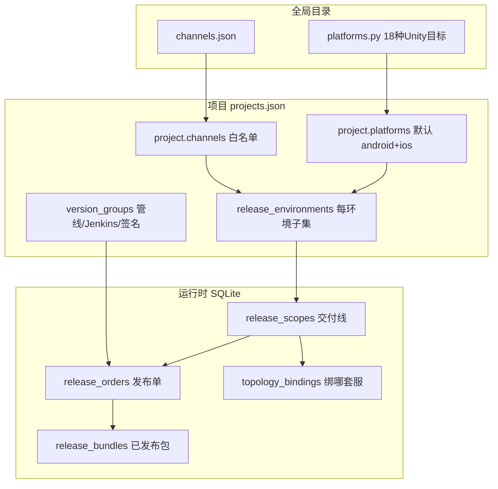

# 全栈架构专家评审报告

**审计范围**：`E:\web\apk-site`（Web 管控面）、`E:\maclient`（Unity 客户端）、`E:\maclient\game-server`（游戏服）  
**审计方式**：直接读源码与仓库内设计文档，不依赖会话记忆；重点文件已逐模块核对  
**审计日期**：2026-07-24  
**文档状态**：专家评审基线（与 `full_stack_gap_analysis.md` 的迭代 closure 清单互补，不互相替代）

**可执行落地计划**：已拆分为 [`plans/README.md`](./plans/README.md)（10 份分步 Plan + 1 份 REF）。排期 / Cursor Plan 请直接引用子文档。

**实现规范**：执行 Plan 时使用 Skill `architecture-plan-implementation` 与 Rules `architecture-plan-*.mdc`（见 [`plans/README.md §3.1`](./plans/README.md)）。

---

## 0. 结论摘要

这是一套 **「团队内网发版 + 运维编排 + Unity 热更」** 的垂直整合平台，**Android 主路径设计方向正确**，ReleaseOrder 状态机与 `runtime-bootstrap` 契约已具备商业产品雏形。

但 **数据层分裂、Ops 巨石模块、平台目录与构建能力脱节、客户端/服务端与发版链未统一编排**，导致：

- **无法直接当多租户 SaaS 上线**
- **不符合大厂「构建 / 发布 / 运行」三平面分离** 的成熟形态

**代码规模（实测）**：

| 仓库 | 规模 | 说明 |
|------|------|------|
| apk-site `portals/common/core` | ~3550 个 `.py` 文件 | 含 routes / services / tests / scripts |
| maclient `Assets` | ~1300 个 `.cs` 文件 | 含 HotUpdate / Editor / Foundation |
| game-server | ~330 个 `.cs` 文件 | Gateway / Auth / Game / Ops / Agent |

**综合评分（专家视角）**：

| 维度 | 分数 | 说明 |
|------|------|------|
| 领域模型合理性 | 7.5/10 | Scope/Bundle/七层归属方向对；平台 catalog 与 build 脱节扣分 |
| 代码可维护性 | 5/10 | Release 域好；Ops/Version 巨石严重 |
| 可操作性 | 6/10 | Android Dev 闭环可用；初始化与 Runtime 前置复杂 |
| 扩展性 | 6/10 | build_grid 模式可扩；存储与 registry 分裂阻碍 |
| 生产就绪 | 4/10 | SQLite/默认密码/CSRF/无服务端发布 — 不能直接外网 SaaS |
| 对标大厂完整度 | 5.5/10 | 客户端发版链接近中小厂上限；缺服务端平面与基础设施 |

**总评**：合格 **内部 Unity 热更发版 + 游戏服运维工具**；不是腾讯级 Release Platform。继续堆 UI 会放大债务；应先 Consolidate 数据层、拆 Ops 巨石、建立 Platform Capability、补 Server Release Plane。

---

## 1. 系统定位与边界

系统实际上叠了 **三个独立产品**，Web 只是编排层：

```text
┌──────────────────────────────────────────────────────────────────┐
│  产品 A：Delivery（交付）                                         │
│  项目 → 环境 → 渠道 → 平台 → Scope → ReleaseOrder → Bundle       │
│  Jenkins 构建 → OSS → runtime-bootstrap → 客户端热更              │
├──────────────────────────────────────────────────────────────────┤
│  产品 B：Build Grid（构建网格）                                   │
│  控制面 + Android/iOS/小游戏 Agent → Jenkins Job 路由            │
├──────────────────────────────────────────────────────────────────┤
│  产品 C：Ops（运行面）                                            │
│  拓扑 / Agent / cluster.json 同步 → 启停 GameServer              │
│  与 ReleaseOrder **无自动部署关联**                               │
└──────────────────────────────────────────────────────────────────┘
         │                                    │
         ▼                                    ▼
   maclient (1300+ cs)              game-server (330 cs)
```

**核心交付单元不是「项目」，而是 Scope**：

```text
scope_id = {project_slug}:{env_key}:{channel_id}:{platform}
例：gomeku:development:1001:android
```

这一设计 **本身合理**，与腾讯 GCloud 渠道包、网易 Nebula 环境隔离、米哈游 launcher 按 channel/env 拉 manifest 的思路一致。问题在于：**Scope 之上的配置层级过多、之下的执行平面未打通**。

### 1.1 三端职责对照

| 问题 | Web 负责 | 客户端负责 | 游戏服负责 |
|------|----------|------------|------------|
| 项目/成员/审批 | ✅ | — | — |
| 渠道/平台白名单 | ✅ | 消费 bootstrap | — |
| Jenkins 构建 | ✅ 触发+参数 | Editor CLI 执行 | — |
| 热更资源 OSS 路径 | ✅ 激活/发布 | ✅ 下载/校验 | — |
| 网关地址 | ✅ network_profile | ✅ 注入 ProtocolNetworkSettings | ✅ Gateway :15050 |
| 游戏逻辑 | — | ✅ HotUpdate 程序集 | ✅ Handler |
| 进程启停/拓扑 | ✅ Ops Agent | — | ✅ cluster.json |

**参数三层（maclient 文档 + 代码一致）**：

1. **构建层**：Jenkins → Unity（Step1–4）
2. **发布层**：activate → OSS `version_metadata.json`
3. **运行层**：客户端启动 → `/api/public/runtime-bootstrap`

Web 是 **管控与编排**；客户端是 **运行时消费者**；游戏服是 **协议与状态**（与 APK 发版链平行，不自动部署 game-server 二进制）。

---

## 2. 配置与数据模型深度剖析

### 2.1 七层归属模型

仓库内 `docs/design_specs/build_release_ownership.md` 定义了七层：

```text
Global Catalog → Project Baseline → Environment Policy → Channel Binding
    → Version Group（★构建 SSOT★）→ VersionCode → Release Order
```

**合理之处**：

- `version_groups[].pipeline_template` 作为 Jenkins 四步管线唯一源（`version_service.resolve_effective_pipeline`）
- `ReleaseBundle` 作为 publish 原子快照（`order_publish_flow._publish_release_order_body`）
- 客户端只消费 `runtime-bootstrap`，不直接读 VersionRow（`Main.cs` → `RuntimeBootstrapService`）

**不合理之处（P0 架构债）**：

| 问题 | 代码证据 | 影响 |
|------|----------|------|
| **双存储 + 三存储** | 发布域 SQLite（`models/db.py`）；项目/渠道 JSON（`data/projects.py` 启动时 `load_document`）；Ops 独立 `OPS_USE_SQLITE`（`services/ops/storage.py`） | 备份、迁移、多实例一致性无统一方案 |
| **Import 时内存缓存** | `projects_db = load_document(PROJECTS_FILE, ...)` 模块加载即读盘 | 多 worker / 多进程下 **脏读、写后不可见** |
| **单 SQLite 连接** | `_conn` 全局 + `threading.RLock()`（`db.py:14-16`） | Waitress 多线程下曾触发 SIGSEGV 注释；无法水平扩展 |
| **Legacy 词汇并存** | `stage` vs `env_key`；3 段 vs 4 段 scope_id（`db.py` 仍有 migration） | 排查问题时 ID 对不上 |
| **平台目录 18 vs 构建 3** | `platforms.py` 18 种 Unity BuildTarget；`build_grid.py` 仅 android/ios/wechat_minigame | UI 可选 ≠ 能构建，**误导运营** |

### 2.2 概念层级：项目 → 环境 → 渠道 → 平台

| 层级 | 存哪 | 谁改 | 关键文件 |
|------|------|------|----------|
| **全局渠道目录** | `data/channels.json` | 管理员 | `routes/admin/api_channels.py` |
| **全局平台目录** | 代码常量（非 JSON） | 改代码发布 | `data/platforms.py` |
| **项目白名单** | `projects.json` 内 `channels[]` / `platforms[]` | 项目管理员 | `services/admin/project_service.py` |
| **环境子集** | `project.release_environments[]` | 项目设置 | `data/delivery_scope.py` |
| **版本组（构建 SSOT）** | `project.version_groups[]` | 版本/管线页 | `services/admin/version_service.py` |
| **版本码 VC** | `project_versions.json` | 版本 API | 同上 |
| **交付 Scope** | SQLite `release_scopes` | 自动/发版流程 | `services/release/scope_resolver.py` |
| **发布单** | SQLite `release_orders` | Journey | `services/release/order_*.py` |

关系图：



### 2.3 渠道与平台：两套 ID 体系

**渠道**在代码里同时存在：

- **numeric channel id**（如 `1001`）→ Scope、VersionRow
- **string channel key**（如 `wechat`）→ OSS 路径、Jenkins `RELEASE_CHANNEL`

映射分散在 `scope_ids.py`、`HotUpdateConfigSyncCli`、Jenkins pipeline，**没有单一 Registry Service**。大厂通常有 **Channel Package Config Center**（腾讯 MSDK 渠道表、网易打包配置中心），改一处全局生效。

**平台**：

- 目录层：`PLATFORM_CATALOG` 硬编码在 Python（改平台 = 改代码发版）
- 构建层：`PLATFORM_TO_JOB` 仅 3 条（`services/build/build_grid.py`）
- DB migration：`release_scopes` 迁移逻辑仍假设 android/ios（`db.py:35-36`），**wechat_minigame 未纳入 migration 分支**

---

## 3. Web 管控面

### 3.1 模块结构

```
portals/common/core/
├── app_new.py                 # 三门户模式 admin/player/forum
├── routes/
│   ├── admin_routes.py        # 全局管理（仍偏大 ~980行）
│   ├── admin/api_*.py         # 项目/版本/渠道/Jenkins/构建节点
│   ├── delivery/              # 交付 UI + API（主路径）
│   ├── ops/                   # 运维 UI + Agent
│   ├── release/               # 公开 scope/manifest API
│   └── internal_*.py          # Jenkins/build-node webhook
├── services/
│   ├── admin/                 # 项目、版本、构建配置
│   ├── release/               # 23+ 文件，发布域核心
│   ├── ops/                   # Agent、拓扑、运行时（helpers 很大）
│   ├── build/                 # 构建网格、节点、产物落地
│   └── commercial_release_plan.py  # Jenkins 参数归一
├── data/                      # platforms, delivery_scope, channels
└── models/db.py               # SQLite 主库
```

**建议读代码顺序**：

1. `delivery_scope.py` + `scope_ids.py` — 搞懂四维 Scope
2. `order_publish_flow.py` + `order_build_sync.py` — 发版状态机
3. `channel_journey_bff.py` — UI 聚合
4. Ops 单独看 `ops/helpers.py` + `environment_runtime_service.py`
5. 别先看 `build_routes.py`（Legacy 构建 UI）

### 3.2 做得好的部分（应保留并强化）

1. **Release 域模块化**（23+ 文件）：`order_crud` / `order_build_sync` / `order_publish_flow` / `channel_journey_bff` / `bundle_service` — 状态机清晰，单测覆盖广（`tests/test_release_*` 等 30+ 测试文件）
2. **Publish 原子语义**：precheck → bundle 快照 → supersede 旧 bundle → 写 `active_bundle_id` → 注入 `network_profile`（`order_publish_flow.py:342-399`）
3. **Jenkins 参数三层分离**：构建 / 发布 / 运行时（`maclient/docs/framework/Web-Jenkins-Unity-ParameterSpec.md`）
4. **Legacy 收敛方向正确**：commercial-release 302 → quick-build（`docs/architecture/full_stack_gap_analysis.md`）

### 3.3 设计不合理（按严重度）

#### P0 — 线上阻断级

| ID | 问题 | 证据 | 大厂对比 |
|----|------|------|----------|
| W-P0-1 | 默认弱凭据 | `config.py`: `JENKINS_DEFAULT_PASSWORD` 默认 `admin123` | 腾讯蓝盾 / 网易 Homer：Secret Manager + RBAC，无默认密码 |
| W-P0-2 | CSRF 大面积豁免 | `app_new.py:264-267` delivery/ops/internal webhook 整 Blueprint exempt | 内网 webhook 应用 HMAC 签名 + IP 白名单，而非关 CSRF |
| W-P0-3 | SQLite 单点 + 单连接 | `db.py` 全局 `_conn` | 米哈游 / 网易：PostgreSQL + 连接池 |
| W-P0-4 | 多 worker 数据不一致 | `projects_db` import 加载 | Redis 缓存 + DB 真源 + 变更通知 |
| W-P0-5 | cluster.json dev token 硬编码 | `game-server/config/cluster.json` `ma-cluster-relay-dev` | 生产必须每环境独立 token + 轮换 |

#### P1 — 架构腐化 / 维护成本爆炸

| ID | 问题 | 证据 |
|----|------|------|
| W-P1-1 | Ops 巨石 | `services/ops/helpers.py` **3400+ 行**、80+ 内部函数：拓扑、Agent、cluster 同步、UI 渲染、诊断全在一个文件 |
| W-P1-2 | 版本服务巨石 | `version_service.py` **1100+ 行**：CRUD + pipeline 解析 + migration + group meta |
| W-P1-3 | 三平面未产品化 | Build Grid（`build_nodes.json`）与 Ops Agent、Jenkins 实例 **三套节点/registry** |
| W-P1-4 | Publish 硬依赖 Runtime | `order_publish_flow.py:381-382` 无 active runtime → 直接失败 |
| W-P1-5 | 文档自评与架构现实 gap | `full_stack_gap_analysis.md` 标「35/35 FIXED」— 指迭代项 closure，不消除 P0 存储/安全/巨石问题 |

#### P2 — 体验与扩展性

| ID | 问题 |
|----|------|
| W-P2-1 | Admin 路由仍偏大（`admin_routes.py` ~980 行） |
| W-P2-2 | 前端 JS 分散：`project_delivery.js` ~2000 行、`project_channel_release_journey.js` 等 |
| W-P2-3 | 平台 UI 无「构建能力」badge（18 平台全展示） |
| W-P2-4 | `build_nodes.json` 不在 DB backup 链路 |

### 3.4 从项目 / 渠道 / 平台角度看

#### 项目：创建 / 管理 / 维护

| 步骤 | 入口 | 后端 |
|------|------|------|
| 新建项目 | `/admin/projects` | `project_service.create_project()` |
| 自动生成 | `game_id` / `game_key` | `_generate_unique_game_credentials()` |
| 默认平台 | `android` + `ios` | `platforms.py::DEFAULT_PROJECT_PLATFORMS` |
| 构建配置 | Git / Unity 路径 | `project.build_config` |

项目内三大子产品：

| 子产品 | 路由前缀 | 职责 |
|--------|----------|------|
| Delivery 交付 | `/admin/projects/{id}/overview`、Journey、发布单 | 构建→预检→发布 |
| Ops 运维 | `/admin/projects/{id}/ops`、拓扑、Agent | 游戏服生命周期 |
| Settings 设置 | 项目设置、成员、环境 | 白名单、策略 |

#### 渠道：创建 / 管理 / 维护

| 操作 | 层级 | API |
|------|------|-----|
| 全局建渠道 | `channels.json` | `api_channels.py` |
| 项目启用渠道 | `project.channels[]` | `project_service.add_channel()` |
| 环境内禁用 | `env.disabled_channels[]` | `delivery_scope.py` |
| Jenkins 渠道参数 | `build_param` / `apk_subdir` | commercial pipeline |

#### 平台：创建 / 管理 / 维护

| 操作 | 能否在 UI 做 | 实际 |
|------|-------------|------|
| 平台目录 | 否 | `platforms.py::PLATFORM_CATALOG` 硬编码 18 种 |
| 项目启用平台 | 是 | `project.platforms[]` |
| 环境内禁用 | 是 | `env.disabled_platforms[]` |
| 构建路由 | 部分 | `build_grid.py` 仅 android / ios / wechat_minigame |

**结构性矛盾**：UI/Scope 层可选 18 种平台；构建网格只有 3 条 Jenkins Job；客户端 Android 闭环完整，iOS/小游戏 pipeline 刚补，WebGL 热更策略不同步。

---

## 4. 客户端（maclient）

### 4.1 启动链

**实际路径（三条并行，按优先级）**：

```text
1. Unified runtime-bootstrap（权威）
   GET /api/public/runtime-bootstrap?game_id&game_key&env_key&channel&platform
   → NetworkProfileInjector → catalog/config/code paths

2. Legacy version-resolve（兼容）
   RuntimeVersionResolveService（PreferWebVersionResolve 开关）

3. OSS 直读 fallback
   .../{Profile}/{Channel}/{platform}/version_metadata.json
```

关键文件：

- `Assets/Src/Main.cs` — 启动编排
- `Assets/Src/HotUpdate/Framework/Bootstrap/RuntimeBootstrapService.cs` — bootstrap API
- `Assets/Content/Resources/HotUpdateConfig.asset` — 本地默认
- `Assets/Resources/Protocol/ProtocolNetworkSettings.asset` — 网络注入目标

**合理**：与米哈游 `version.json` + CDN、腾讯 Puffer 按 env 拉 manifest 一致；`network_profile` 从 Web 注入避免客户端硬编码网关。

**不合理**：

| ID | 问题 | 证据 |
|----|------|------|
| C-P1-1 | 三路径长期并存 | `Main.cs` `ShouldPreferWebVersionResolve` + bootstrap + OSS |
| C-P1-2 | 配置真源分散 | HotUpdateConfig + ProtocolNetworkSettings + Portal bootstrap + HotUpdateConfigSyncCli |
| C-P1-3 | WebGL/小游戏无 HybridCLR | 热更策略与 Android 不同步 |
| C-P1-4 | iOS 生产签名未完成 | XcodeArchiveCli 仅 development export |

### 4.2 构建链（Editor）

设计 **较好**：

- `CommercialReleasePipelineRegistry.cs` 注册 Step1-4 executeMethod
- 与 Jenkins `commercial_android_pipeline.sh` 对齐
- 参数规范 `maclient/docs/framework/Web-Jenkins-Unity-ParameterSpec.md` 可作为对外契约

```text
Step1: ConfigRemotePublishCli     （导表 + 配置 OSS）
Step2: ResourcePipelineCli        （资源打包）
Step3: CommercialReleaseCli       （热更 upload）
Step4: CommercialReleaseCli       （activate/rollback → version_metadata）
```

---

## 5. 游戏服（game-server）

### 5.1 拓扑模型

`game-server/config/cluster.json` 定义四服务：

| 服务 | 端口 | 角色 |
|------|------|------|
| gateway-cn-1 | 15050 | 客户端 WS |
| auth-cn-1 | 5501 | 认证 |
| game-cn-1 | 5502 | 业务 |
| ops-cn-1 | 5504 | Portal `/ops/*` |

Portal 通过 `_sync_cluster_to_agents()`（`helpers.py:3170+`）把 cluster.json 同步到 Agent registry — **设计意图正确**（cluster 为 SoT）。

### 5.2 与 Delivery 的关系（关键 gap）

```text
ReleaseOrder publish  →  更新 Bundle + network_profile  →  客户端连 gateway
                        ✗  不部署 / 不重启 game-server 二进制
                        ✗  不推送服务端配置 / 表结构 / 协议版本
```

**大厂做法**：

- **腾讯**：客户端发版（Puffer）与服务端发版（K8s + 配置中心）同一发布单关联，但不同流水线
- **网易**：Homer 管包；NKS/Nebula 管服；发布单有 client artifact id + server artifact id
- **米哈游**：launcher 版本与服务端 gate 版本联合校验；服务端滚动发布独立 Job

当前 **Ops 与 Release 只在 dashboard 关联展示**，无 **Server Release Order** — 架构级缺失。

### 5.3 生产就绪 gap

| 项 | 现状 |
|----|------|
| 部署 | `Program.cs --all` 单体 / 手工 MSBuild |
| 配置 | `GlobalConfig.Current` + JSON，无 K8s ConfigMap |
| 扩缩 | 无 HPA / 无服务发现 |
| 观测 | `ServerLogger` 本地日志；Portal Agent 探针 — 无统一 APM |
| 安全 | dev relay token；Mongo/Redis 本地假设 |

---

## 6. 可操作性审计

基于 `order_build_sync.quick_publish_delivery` + Journey + precheck 代码路径：

| 阶段 | 步骤数 | 操作 | 可简化？ |
|------|--------|------|----------|
| 项目初始化 | 8-12 | 建项目 → 配 Git/Unity → 加渠道 → 配环境 → 版本组 pipeline → Jenkins 实例 → 拓扑绑定 → Agent 注册 | 可合并为 Wizard |
| 日常 Dev 构建 | 4-6 | 选 VC → Journey 构建 → 等 Jenkins → webhook/poll → artifacts_ready | quick-build 已简化为 1 API |
| Dev 发版 | 5-8 | 启 Runtime → precheck → publish → verify → 客户端冷启 | Dev 可自动启 Runtime |
| Prod 发版 | 12-15 | full 表单 → 构建 → precheck → 审批 → publish → verify → 灰度 → 监控 | 缺自动回滚触发 |
| 加新渠道 | 5 | 全局 channels → 项目 assign → 环境 scope → VC 行 → Jenkins → 客户端映射 | 应 1 个 API 原子创建 |
| 加可构建平台 | 7+ | platforms.py → project → build_grid → Jenkins Job → pipeline → Editor CLI → signing | 应 Platform Capability Registry |

**对比**：腾讯蓝盾 / 网易 DevCloud 新项目 **30 分钟内** 可跑通 CI；当前 **熟练工程师 0.5-1 天，新人 3-5 天**。

### 6.1 维护决策表

| 我要… | 改 Web | 改 maclient | 改 game-server |
|-------|--------|-------------|----------------|
| 新建项目 | `project_service` + projects.json | — | — |
| 加全局渠道 | `channels.json` + admin UI | `HotUpdateConfigSyncCli` 映射 | — |
| 项目启用渠道 | `project.channels` | — | — |
| 某环境隐藏渠道 | `release_environments[].disabled_channels` | — | — |
| 加平台（仅 UI） | `platforms.py` + project.platforms | — | — |
| 加平台（能构建） | build_grid + Jenkins job + version group API | 新 BuildScript/CLI | — |
| 改 Jenkins 管线 | `version_groups[].pipeline_template` | Registry/CLI | — |
| 改客户端网关 | topology + bootstrap network_profile | ProtocolNetworkSettings | cluster.json Gateway |
| 启停游戏服 | Ops Agent / DevStack | — | `Start-GameServer.ps1` |
| 发版 | ReleaseOrder Journey | 消费 bootstrap | — |

---

## 7. 与成熟商业方案对照

| 维度 | 腾讯（典型手游） | 网易 | 米哈游 | **本项目** |
|------|------------------|------|--------|------------|
| 配置中心 | Rainbow / 自研 CMDB | 配置平台 + Homer | 自研 launcher 配置 | JSON + SQLite 混合 |
| 构建 | 蓝盾 + 专用编译机池 | DevCloud + 打包机 | 自研 CI + Unity 农场 | Jenkins + build_grid（3 平台） |
| 制品 | Puffer CDN + 多渠道包 | CDN + NPK | OSS + 整包/差分 | OSS + local APK 落盘 |
| 发布 | 发布单 + 灰度 + 审批 | 发布系统 + 回滚 | 分阶段 + 强制更新 gate | ReleaseOrder 状态机 ✅ |
| 客户端拉包 | MSDK + Puffer | 渠道 SDK | launcher bootstrap | runtime-bootstrap ✅ |
| 服务端发布 | K8s + 配置热更 | 独立管线 | 独立 rolling | **未纳入 ReleaseOrder** ❌ |
| 环境隔离 | 正式/体验/测试服 | 多环境集群 | 区服 + env | env_key 四维 Scope ✅ |
| 观测 | Galileo / 自研 | 自研 APM | 自研 | Agent 探针 + 局部 Prometheus |
| 权限 | RBAC + 审计 | 工单 + 审批 | 内部 SSO | 项目级 can_edit + 审批 API |

**优势**：Unity 四步管线 + Scope 四维 + bootstrap 契约比很多中小团队完整。  
**差距**：缺统一 Registry、服务端发布平面、生产级存储与安全。

---

## 8. 线上必须处理的事项

### Phase 0 — 上线前阻断（2-4 周）

1. 去掉所有默认密码（Jenkins、admin、cluster relay token）→ Secret 注入
2. SQLite → PostgreSQL（至少 Release + Project 域）；或单进程 + 文件锁写进部署文档
3. `projects_db` 改为请求级读 DB，禁止 import 缓存
4. Webhook 鉴权：Jenkins build-complete、approval webhook — HMAC + nonce
5. CSRF 策略收紧：仅 JSON API 用 token；internal 用 mTLS 或 shared secret
6. 备份策略：DB + `data/jenkins_instances` + OSS 路径索引 — 统一 runbook

### Phase 1 — 可运维（1-2 月）

7. 拆分 `ops/helpers.py` → topology_service / agent_sync_service / runtime_orchestrator / cluster_importer
8. Platform Capability Registry：UI 只展示 build_grid 支持的平台 +「仅客户端」标记
9. Project Onboarding Wizard：一步创建 project + 默认 env + 渠道 + version_group + Jenkins 模板
10. Dev Runtime Auto-Start：development 环境 precheck 前自动 `ensure_runtime`
11. build_nodes 入库：与 Jenkins 实例同一 SQLite schema

### Phase 2 — 商业级（3-6 月）

12. Server Release Plane：`server_release_orders` + game-server 制品 + 滚动重启 Job
13. 统一 Node Registry：Build Agent = Ops Agent = Jenkins label 一张表
14. 客户端单路径：废弃 version-resolve 与 OSS fallback（保留 1 个 major 版本兼容层）
15. 多平台签名中心：iOS p12/profile、Android keystore、微信 miniprogram-ci — 统一 Secret Store API
16. 观测闭环：发布 verify 失败 → 自动 rollback + 飞书/钉钉告警

---

## 9. 具体改造方向

### 9.1 目标架构（建议终态）

```text
                    ┌─────────────────┐
                    │  Config Registry │  ← 项目/渠道/平台/环境 单一 API
                    │  (PostgreSQL)    │
                    └────────┬────────┘
                             │
        ┌────────────────────┼────────────────────┐
        ▼                    ▼                    ▼
┌───────────────┐   ┌───────────────┐   ┌───────────────┐
│ Build Plane   │   │ Release Plane │   │ Runtime Plane │
│ Jenkins Grid  │   │ Client Bundle │   │ GameServer    │
│ 3→N platforms │   │ + Bootstrap   │   │ + Topology    │
└───────────────┘   └───────────────┘   └───────────────┘
        │                    │                    │
        └────────────────────┴────────────────────┘
                             │
                    Unified Release Ticket
                    (client_artifact + server_artifact + network_profile)
```

### 9.2 不要做的事

- 不要写第四套 Legacy 路由（继续收敛到 Journey + ReleaseOrder）
- 不要在 `version_service.py` 上继续堆功能 — 应拆 `pipeline_resolver.py` / `version_group_repo.py`
- 不要为了「快速」把 Ops 逻辑塞回 Delivery — 用 Unified Release Ticket 关联
- 不要扩 `PLATFORM_CATALOG` 到 18 个都可点构建 — 先 Capability 驱动 UI

### 9.3 建议保留并作为卖点的设计

1. Scope 四维 + ReleaseBundle 快照
2. runtime-bootstrap 单一客户端入口
3. Version Group pipeline SSOT
4. Topology Binding 矩阵
5. maclient 四步 Commercial Pipeline Registry

### 9.4 落地计划文档（已拆分）

详见 **[`plans/README.md`](./plans/README.md)**，摘要：

| ID | 文档 | 优先级 |
|----|------|--------|
| P0-01 | [production_security_hardening](./plans/P0-01_production_security_hardening.md) | 安全 / Secret / Webhook |
| P0-02 | [config_registry_migration](./plans/P0-02_config_registry_migration.md) | 存储统一 / 去 import 缓存 |
| P1-01 | [ops_helpers_split](./plans/P1-01_ops_helpers_split.md) | Ops 巨石拆分 |
| P1-02 | [project_onboarding_wizard](./plans/P1-02_project_onboarding_wizard.md) |  onboarding 向导 |
| P1-03 | [platform_capability_registry](./plans/P1-03_platform_capability_registry.md) | 18 vs 3 平台 |
| P1-04 | [dev_delivery_simplification](./plans/P1-04_dev_delivery_simplification.md) | Dev Runtime 自动化 |
| P1-05 | [node_registry_unification](./plans/P1-05_node_registry_unification.md) | Build/Ops 节点统一 |
| P2-01 | [server_release_plane](./plans/P2-01_server_release_plane.md) | 服务端发布 |
| P2-02 | [client_bootstrap_consolidation](./plans/P2-02_client_bootstrap_consolidation.md) | 客户端单路径 |
| P2-03 | [observability_incident_loop](./plans/P2-03_observability_incident_loop.md) | 告警 / 自动回滚 |
| REF | [domain_model_and_ops](./plans/REF_domain_model_and_ops.md) | 领域模型参考 |

---

## 10. 若只记三件事

1. **一切发版围绕 Scope** `{project}:{env}:{channel}:{platform}`，不是围绕「项目」一个按钮。
2. **三套系统平行**：Delivery（APK/热更）、Build Grid（Jenkins）、Ops（游戏服）— Web 编排，但不自动串联部署服。
3. **配置 SSOT 分裂**：版本组管构建、VC 管实例、channels/platforms 管白名单、cluster.json 管服 — 改一项要查表，不能凭直觉。

---

## 11. 关键文件索引

| 层级 | 路径 |
|------|------|
| Web 入口 | `portals/common/core/app_new.py` |
| 数据层 | `portals/common/core/models/db.py`、`data/projects.py`、`data/_store.py` |
| Scope / 交付范围 | `data/delivery_scope.py`、`services/release/scope_ids.py` |
| 发布状态机 | `services/release/order_publish_flow.py`、`order_build_sync.py` |
| Journey BFF | `services/release/channel_journey_bff.py` |
| Ops 巨石 | `services/ops/helpers.py` |
| 构建网格 | `services/build/build_grid.py` |
| 平台目录 | `data/platforms.py` |
| 七层归属 spec | `docs/design_specs/build_release_ownership.md` |
| 全链路真源 | `docs/full_release_chain_architecture.md` |
| 迭代 gap 清单 | `docs/architecture/full_stack_gap_analysis.md` |
| 构建网格 spec | `docs/design_specs/distributed_build_grid_p1_p5.md` |
| 客户端 bootstrap | `maclient/Assets/Src/Main.cs`、`RuntimeBootstrapService.cs` |
| Jenkins 参数契约 | `maclient/docs/framework/Web-Jenkins-Unity-ParameterSpec.md` |
| 游戏服拓扑 | `maclient/game-server/config/cluster.json` |
| Dev 一键栈 | `scripts/Start-DevStack.ps1` |

---

## 12. 文档关系说明

| 文档 | 关系 |
|------|------|
| `full_stack_gap_analysis.md` | 2026-07-22 迭代项 closure（W-01…C-04 等 35 ID）；**不覆盖** 本报告 P0 存储/安全/架构类问题 |
| `full_release_chain_architecture.md` | 八段闭环与主键定义真源；部分接口描述可能落后于代码 |
| `build_release_ownership.md` | 七层字段归属；与本报告 §2.1 对齐 |
| **本报告** | 专家评审基线：不合理设计、简化点、线上事项、大厂对照、改造路线图 |
| **`plans/`** | 可执行分步 Plan；实施细节以子文档为准 |

---

## 13. 变更记录

| 日期 | 说明 |
|------|------|
| 2026-07-24 | 初版：全栈架构专家评审报告落地 |
| 2026-07-24 | 拆分为 `plans/` 下 10 份 Plan + REF + README 索引 |
| 2026-07-29 | 增加 [`PLAN_CLOSURE_STATUS.md`](./PLAN_CLOSURE_STATUS.md)：Plan DoD + W/C 缺口真源；**W/C 项尚未 formal closure** |
