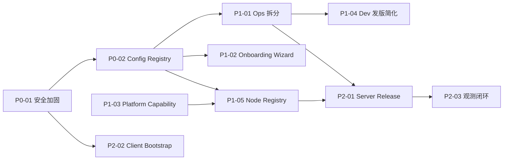

# 全栈改造落地计划索引

> 由 [`full_stack_expert_review.md`](../full_stack_expert_review.md) 拆分而来。  
> 每个子文档均可 **单独开 Plan / 开 PR**；依赖关系见下表。

**用法**：在 Cursor Plan 或排期表中引用 `docs/architecture/plans/Px-xx_*.md` 作为任务真源。

> **Closure 真源（必读）**：Plan 里的 `[x]` **不等于线上可用**。未完成项、假绿项、评审 W/C closure 状态见 **[`PLAN_CLOSURE_STATUS.md`](../PLAN_CLOSURE_STATUS.md)** — 排查线上问题从该文档 §6 入手。

---

## 1. 计划总览

| ID | 文档 | 优先级 | 预估 | 依赖 | 解决评审项 |
|----|------|--------|------|------|------------|
| REF | [REF_domain_model_and_ops.md](./REF_domain_model_and_ops.md) | — | — | — | 领域模型、决策表、大厂对照（只读参考） |
| P0-01 | [P0-01_production_security_hardening.md](./P0-01_production_security_hardening.md) | P0 | 1–2 周 | 无 | W-P0-1, W-P0-2, W-P0-5 |
| P0-02 | [P0-02_config_registry_migration.md](./P0-02_config_registry_migration.md) | P0 | 2–4 周 | 无 | W-P0-3, W-P0-4, 双/三存储 |
| P1-01 | [P1-01_ops_helpers_split.md](./P1-01_ops_helpers_split.md) | P1 | 2–3 周 | P0-02 可选 | W-P1-1 |
| P1-02 | [P1-02_project_onboarding_wizard.md](./P1-02_project_onboarding_wizard.md) | P1 | 2 周 | P0-02 建议 | 初始化 8–12 步 → 1 向导 |
| P1-03 | [P1-03_platform_capability_registry.md](./P1-03_platform_capability_registry.md) | P1 | 1–2 周 | 无 | W-P2-3, 18 vs 3 平台 |
| P1-04 | [P1-04_dev_delivery_simplification.md](./P1-04_dev_delivery_simplification.md) | P1 | 1–2 周 | P1-01 部分 | W-P1-4, Dev 发版 5–8 步 |
| P1-05 | [P1-05_node_registry_unification.md](./P1-05_node_registry_unification.md) | P1 | 2 周 | P0-02, build_grid | W-P1-3, W-P2-4 |
| P2-01 | [P2-01_server_release_plane.md](./P2-01_server_release_plane.md) | P2 | 4–8 周 | P1-01, P1-05 | 服务端发布 gap |
| P2-02 | [P2-02_client_bootstrap_consolidation.md](./P2-02_client_bootstrap_consolidation.md) | P2 | 3–4 周 | P0-01 | C-P1-1, C-P1-2 |
| P2-03 | [P2-03_observability_incident_loop.md](./P2-03_observability_incident_loop.md) | P2 | 2–4 周 | P2-01 可选 | Prod 事故、自动回滚 |

---

## 2. 推荐执行顺序

**最小可上线路径（内网 Android Dev）**：P0-01 → P1-04 → P1-02  
**最小可上线路径（Prod 客户端发版）**：P0-01 → P0-02 → P1-03 → P1-04 → P2-03  
**完整三平面**：上述 + P1-01 → P1-05 → P2-01 → P2-02

---

## 3. 每个 Plan 文档结构（统一模板）

子文档均包含：

1. **目标与评审项映射**
2. **范围**（In / Out）
3. **前置条件**
4. **分步实施**（Step 1…N，含改哪些文件、验收标准）
5. **测试与门禁**
6. **回滚策略**
7. **完成定义（DoD）**

### 3.1 实现规范（Skill / Rule）

执行任一 Plan 时必须遵守：

| 类型 | 路径 | 用途 |
|------|------|------|
| **Skill** | `.cursor/skills/architecture-plan-implementation/SKILL.md` | 工作流：读 Plan → 单 Step 实现 → 验收 → DoD |
| **标准** | `.cursor/skills/architecture-plan-implementation/STANDARDS.md` | 可读性、分层、文件大小、注释、UTF-8 中文 |
| **清单** | `.cursor/skills/architecture-plan-implementation/CHECKLIST.md` | 每 Step 门禁勾选 |
| **Rule（全局）** | `.cursor/rules/architecture-plan-implementation.mdc` | 禁止巨石文件、单 Step 范围、乱码 |
| **Rule（Python）** | `.cursor/rules/architecture-plan-python-layers.mdc` | routes / services / repositories 分层 |
| **Rule（前端）** | `.cursor/rules/architecture-plan-frontend.mdc` | JS 拆分、中文 UI、node --check |

与安全改动流程叠加：`.cursor/rules/safe-change-workflow.md`（语法检查、最小补丁）。

---

## 4. 与现有文档关系

| 文档 | 关系 |
|------|------|
| `full_stack_expert_review.md` | 评审结论总览；细节以本目录 Plan 为准 |
| `full_stack_gap_analysis.md` | 2026-07-22 迭代 closure；与 Plan 互补 |
| `full_release_chain_architecture.md` | 主键与八段闭环真源 |
| `build_release_ownership.md` | 七层字段归属；P0-02 / P1-02 需对齐 |
| `distributed_build_grid_p1_p5.md` | P1-05 构建网格扩展参考 |

---

## 5. 变更记录

| 日期 | 说明 |
|------|------|
| 2026-07-24 | 由 expert review 拆分为 10 份可执行 Plan + 1 份 REF |
| 2026-07-24 | §3.1 增加 architecture-plan-implementation skill 与 rules |
