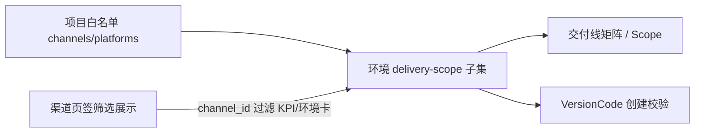

# 项目总览（Project Overview）

> 构建参数 / 发布参数的分层归属与解析顺序，请见配套文档：[`build_release_ownership.md`](build_release_ownership.md)。

## 七层数据架构（与本页 Tab 对应）

```
Global Catalogs        渠道 / 平台 / Unity 版本目录
       ↓
Project Baseline       Git / Unity / 产物根 / 白名单      ← 运行概览 + 平台 + 渠道
       ↓
Environment Policy     交付范围 / form_depth / 审批      ← 环境管理
       ↓
Channel Binding        渠道级 Job / 包名后缀 / 签名 ref  ← 渠道管理 → 渠道详情
       ↓
Version Group     ★    pipeline_template / Jenkins / Bootstrap  ← 版本页 → 配置管线（★ 唯一构建源 ★）
       ↓
VersionCode            只读快照 + 构建产物               ← 版本页 → 版本组 → VC
       ↓
Release Order          发布计划 + 状态机                 ← 发布单页
```

## 路由

- 运行概览：`/admin/projects/{project_id}/overview`
- 渠道管理：`/admin/projects/{project_id}/overview?tab=channels`
- 平台管理：`/admin/projects/{project_id}/overview?tab=platforms`
- 环境管理：`/admin/projects/{project_id}/overview?tab=environments`

## 架构说明（数据层级 vs UI 导航）

PRD 数据层级仍为 **project → env → channel → platform → version**。存储、Scope ID、发布单与 VersionCode 均按 **环境 × 渠道 × 平台** 组织。

运行概览的 **渠道页签** 是运营视角的聚合筛选，不是第二套数据层级：

| 维度 | 说明 |
|------|------|
| 数据 / API | `release_environments[].channels/platforms` 定义每环境交付子集；矩阵与 Scope 在环境内按渠道×平台展开 |
| UI 导航 | 项目总览 → 渠道页签（`?channel_id=`）→ 各环境卡；深度配置在环境管理 Tab / 环境详情 |
| 交付范围模型 | 渠道子集 × 平台子集的笛卡尔积（非逐格「每渠道单独勾选平台」矩阵） |
| Scope 初始化 | 改交付范围后需 **手动**「初始化交付线 Scope」；不会自动增删 scope 行 |
| 配置范围入口 | **配置范围 / 配置平台** 用于环境交付子集；**新建 VersionCode** 在版本页，仅能选已配置组合 |



## 页内 Tab

| Tab | 内容 |
|-----|------|
| 运行概览 | 项目渠道/平台 chips、**渠道页签**（全部/各渠道）、KPI、环境卡片、最近动态 |
| 渠道管理 | 渠道白名单 CRUD、初始化交付线 Scope |
| 平台管理 | 平台白名单（Android / iOS 等）CRUD、禁用/启用 |
| 环境管理 | 项目环境列表（启用/禁用/删除）、每环境交付范围「配置」 |

## 项目平台模型

未配置 `platforms` 时默认 **Android + iOS 全部启用**。字段：

- `platforms`: 白名单平台 ID 列表（`android` / `ios`）
- `disabled_platforms`: 已禁用但仍保留在白名单的平台

交付线矩阵、发布单、Scope 初始化均只使用 **已启用** 的平台。

## 三层配置说明

| 层级 | 配置内容 | 入口 |
|------|----------|------|
| 项目 | 渠道/平台白名单（上限） | 运行概览 → 渠道管理 / 平台管理 |
| 环境 | 本环境支持的渠道×平台子集 | 环境管理 Tab「配置」；环境详情「配置范围」；运行概览环境卡「配置范围」 |
| VersionCode | 具体构建号 | 版本页新建 VC（仅能选已配置组合） |

## 运行概览渠道页签

- 页签：`全部渠道` + 项目已启用渠道各一项
- URL：`?channel_id=` 与页签同步
- 选中渠道后：KPI 与环境卡 **仅统计该渠道** 交付线；环境卡显示「本渠道平台」；**配置范围** 弹层始终展示完整已保存配置（与页签无关）

## 环境筛选（运行概览）

Query 参数：`env_key`、`channel_id`（渠道页签）、`platform`、`health`

渠道页签选中时 **不展示** 未纳入该渠道交付范围的环境卡；KPI 仅汇总可见环境。

## 数据 API

- `GET /api/projects/{id}/overview?env_key=&channel_id=&platform=&health=`
- `GET/POST /api/projects/{id}/environments`
- `PATCH/DELETE /api/projects/{id}/environments/{env_key}`
- 渠道：`POST /api/projects/{id}/channels/{add|remove|disable|enable}`
- 平台：`POST /api/projects/{id}/platforms/{add|remove|disable|enable}`
- 环境交付范围：`GET/PATCH /api/projects/{id}/environments/{env_key}/delivery-scope`

## 环境交付范围

每个环境可在 **项目渠道/平台白名单** 内单独配置子集（`release_environments[].channels` / `platforms`）。未配置时继承项目白名单。

- 禁用项：`disabled_channels` / `disabled_platforms`（仅在已分配子集内生效）
- 消费方：交付线矩阵、Scope 初始化、`context-options`（带 `env_key`）、VersionCode 创建校验
- UI：环境管理 Tab「配置」；环境详情侧栏「本环境交付范围」；运行概览渠道页签环境卡「配置范围/配置平台」

## 版本组

项目记录 `version_groups[]` 存储版本组元数据（与 VersionCode 行分离）：

- `GET /admin/projects/{id}/version-groups`
- `POST /admin/projects/{id}/version-groups/create`
- `POST /admin/projects/{id}/version-groups/update`
- `POST /admin/projects/{id}/versions/delete-group`（删除组及 VersionCode，或仅删空组元数据）

## 项目环境模型

`projects_db[project_id].release_environments`：

```json
{"env_key":"development","label":"开发环境","builtin":true,"enabled":true,"order":10,"channels":["1001"],"platforms":["android"],"disabled_channels":[],"disabled_platforms":[]}
```

缺省时种子 4 个内置环境。自定义 `env_key`：`^[a-z][a-z0-9_]{0,31}$`。

## 验收清单（交付范围闭环）

运行环境：`127.0.0.1:5003`（`scripts/run_admin_5003.ps1`）。自动化：`scripts/smoke_delivery_scope.ps1` / `scripts/smoke_delivery_scope.py`。

| # | 步骤 | 预期 | 验收（2026-06-09） |
|---|------|------|---------------------|
| 1 | 项目白名单：渠道管理添加微信/抖音；平台管理含 Android/iOS/Windows | 白名单可保存 | **手动 UI**（GomeKu 当前仅 `1001` 微信；补抖音需 UI 操作） |
| 2 | 开发环境「配置范围」仅勾选微信 + Android → 保存 | 矩阵/概览开发环境交付线为 **1**（非全量笛卡尔积） | **手动 UI**（保存后核对环境卡 `delivery_line_count`） |
| 3 | 渠道管理「初始化交付线 Scope」 | count > 0 | **手动 UI** |
| 4 | 渠道页签选「微信」 | KPI/环境卡仅反映该渠道；未纳入渠道的环境显示引导文案；「配置平台」可保存 | **手动 UI**（空状态文案：`本环境尚未纳入该渠道，点击配置平台`） |
| 5 | `/versions?env_key=development&channel_id=...` 新建 VC | 平台下拉仅环境允许项；提交成功 | **手动 UI** |
| 6 | `GET /api/projects/{id}/environments/development/delivery-scope` | 未登录 JSON `401` + `ok:false`；已登录 `ok:true` | **PASS**（smoke + 单元测试） |
| 7 | `GET /api/projects/{id}/overview?channel_id=` | 已登录返回环境卡且含 `delivery_line_count` | **PASS**（smoke，`GomeKu` dev + `1001` → `dev_lines=2`） |

说明：**配置范围 ≠ 新建 VC 的唯一入口**；版本页在 URL 锁定 `env_key` / `channel_id` 后从 `context-options?env_key=` 拉取平台子集。

## 关键文件

- 模板：`portals/common/core/templates/project_overview.html`
- 脚本：`portals/common/core/static/project_delivery.js`
- 样式：`portals/common/core/static/project_delivery.css`
- 概览聚合：`services/release/release_order_service.py` → `project_overview()`
- 环境注册：`services/release/env_registry.py`
- API 鉴权：`services/authz.py`（`/api/*` 未登录/无权限返回 JSON 401/403）
- 单元测试：`portals/common/core/tests/test_delivery_scope.py`
- Smoke：`portals/common/core/scripts/smoke_delivery_scope.ps1`
