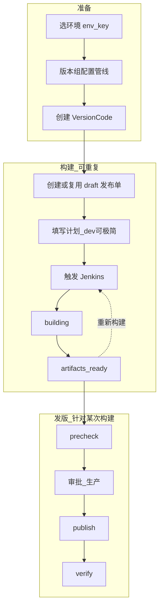

# 发布主路径（Release Journey Unified）

## 双管线（Canonical）

自 2026-07-07 起，**构建**与**发版**为两条独立分步引导管线，入口粒度为 **环境 × 渠道**（平台在流程内选择）。

| 管线 | 规格 | URL |
|------|------|-----|
| 构建 | [`build_journey_channel.md`](build_journey_channel.md) | `/environments/{env}/channels/{channel_id}/build` |
| 发版 | [`release_journey_channel.md`](release_journey_channel.md) | `/environments/{env}/channels/{channel_id}/release` |

发布单详情降为 **发版管线内的执行页**（预检清单、审批、复杂诊断），不再作为构建主界面。

## 三阶段模型

交付按 **准备 → 构建 → 发版** 理解；发布单是贯穿三阶段的审计容器（一次 Delivery Attempt），不是「点上线才创建」的临时记录。

### 构建与发版能否分开？

| 维度 | 结论 |
|------|------|
| **业务操作** | **可分开**：同一 VC 可多次构建；产物就绪后可隔日再预检/发布；重新构建不必立刻再发布 |
| **数据模型** | **绑在一起**：每次构建必须关联发布单（PRD §14.3）；Jenkins 触发统一走 `release_order_service.request_build` |
| **UI 表达** | 环境×渠道 **并列「进入构建流程」「进入发版流程」**；版本行保留快捷 secondary |

## 唯一入口（更新）

**环境详情 → 渠道头「进入构建流程 / 进入发版流程」**；版本代码在已选渠道时显示相同双入口。

| 用户意图 | 入口 | 行为 |
|----------|------|------|
| 编包 / 重编 | 进入构建流程 | 6 步构建管线 |
| 产物就绪要上线 | 进入发版流程 | 7 步发版管线 |
| 发布指定历史版本 | 发版流程 · 选目标版本 | publish-bundle API |
| 撤回下线 | 发版流程 · 运维 | unpublish API |

旧入口 `/release-orders/start?intent=` 重定向到对应管线页。

## 唯一入口（Legacy — 收敛中）

~~版本代码页行内「触发构建」或「继续发版」~~ → 改为 secondary 快捷操作；主入口为双管线。

## 标准七步（含阶段标注）

| 步骤 | 阶段 | 做什么 | 主要页面 |
|------|------|--------|----------|
| 1 | 准备 | 选 VC（必须先有 env_key） | 版本代码 |
| 2 | 准备 | 版本组管线就绪 | build-config |
| 3 | 构建前 | 填发布计划（dev=minimal / prod=full） | 发布单编辑 |
| 4 | 构建 | 触发 Jenkins | 发布单详情 / 版本行 quick-build |
| 5 | 发版 | 预检 | 发布单详情 |
| 6 | 发版 | 发布（生产需审批） | 发布单详情 |
| 7 | 发版 | 可选验证 | 发布单详情 |

## URL 参数契约

| 参数 | 用途 |
|------|------|
| `env_key` | 环境 canonical key |
| `channel_id` | 渠道 ID |
| `platform` | 平台小写 ID |
| `version_id` | **VersionCode 主键**（创建/构建/预检） |
| `release_order_id` | 发布单主键 |
| `intent` | `build` 触发构建；`release` 继续发版（默认） |
| `version_name` / `version_code` | 只读展示，不作为创建依据 |

Helper：`static/delivery_scope.js` → `DeliveryScope.buildQuery()` / `parseQuery()`

## 页面职责

| 页面 | 角色 |
|------|------|
| 版本代码 | **操作台 / 唯一交付入口**（触发构建 + 继续发版） |
| 版本组管线 | 准备步骤（非发布入口） |
| 发布单编辑 | 计划填写（full 环境或首次必填时） |
| 发布单详情 | **执行台**：构建中 / 预检 / 发布 / 验证 + 阶段条 |
| 发布单中心 | 列表管理（scoped，无侧栏入口） |
| 环境详情 | 交付范围准备，深链到版本代码 |
| 构建产物 | 只读查看 + 下载 |

## 删除/降级入口

- `/release-orders/new` 无 version_id → 重定向 `/versions?hint=pick_vc`
- `/versions/{id}/workflow` → 重定向 `release-orders/start?intent=build`
- 环境详情矩阵 → 深链版本代码（不再用「开始发布」文案）
- 发布单列表「新建发布单」→ 去版本页
- 表单：假快捷入口（导入发布计划等）

## Dev/Test vs Prod

| | Dev/Test | Prod |
|---|----------|------|
| form_depth | minimal | full |
| 审批 | 无 | 预检后 awaiting_approval |
| 表单字段 | 目标+原因+负责人 | +验证/回滚/灰度 |
| 构建入口 | 版本行一键 quick-build | 须先填计划再构建 |

## 发布单详情阶段条

三阶段标签：**准备 | 构建 | 发版**（映射 `phase_index` 0/1/2）
