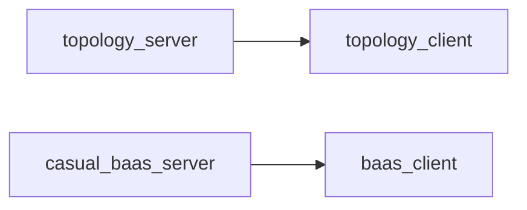

# 服务器框架四模块拆分

| 模块 key | 类型 | 说明 |
|----------|------|------|
| `topology_server` | 服务端 | Agent / Runtime / 拓扑 / runtime-bootstrap |
| `casual_baas_server` | 服务端 | Portal REST BaaS / baas-bootstrap |
| `topology_client` | 客户端 | WebSocket gateway + ProtocolNetworkSettings |
| `baas_client` | 客户端 | HTTP REST + BaasNetworkSettings |

## 环境变量（部署）

```bash
# 全量（默认）
PORTAL_SERVER_FRAMEWORKS=all

# 仅拓扑中重度
PORTAL_SERVER_FRAMEWORKS=topology

# 仅轻度 BaaS
PORTAL_SERVER_FRAMEWORKS=baas
```

| 值 | 注册的 Portal 组件 |
|----|-------------------|
| `topology` | `project_ops` blueprint、runtime-bootstrap |
| `baas` | `baas_public` blueprint、baas-bootstrap |
| `all` | 两者 |

Delivery / Admin / Release 基座始终加载；拓扑预检与 Runtime 仅在 `topology` 项目 + 框架启用时执行。

## 客户端统一入口

```
GET /api/public/client-bootstrap?game_id=&game_key=&...
GET /api/public/client-network-module?game_id=&game_key=&...
```

按项目 `server_mode` 自动返回对应 bootstrap 与客户端包路径。

## 客户端包（导入）

| 服务器模式 | 包路径 | 文档 |
|------------|--------|------|
| topology | `packages/client_network/topology/` | 拓扑 WebSocket 模块 |
| casual_baas | `packages/client_network/baas/` | BaaS REST 模块 |

## Portal 编辑器分流

| 编辑器 | 模块 |
|--------|------|
| 拓扑工作台、绑定抽屉、发版服务端 Tab | `topology_client` |
| 休闲服务控制台、架构设置 | `baas_client` |

## 代码入口

- 注册表：`portals/common/core/server_frameworks/registry.py`
- Bootstrap 路由：`portals/common/core/server_frameworks/bootstrap.py`
- 共享 server_mode：`portals/common/core/services/server_mode.py`

## 配对关系



部署 `topology_server` + 导入 `topology_client` → 中重度全链路。  
部署 `casual_baas_server` + 导入 `baas_client` → 轻度 Passport 全链路。

## 上线部署

详见 [deploy_architecture.md](../runbooks/deploy_architecture.md)（三模式启动、Bootstrap、客户端导入、检查清单）。
