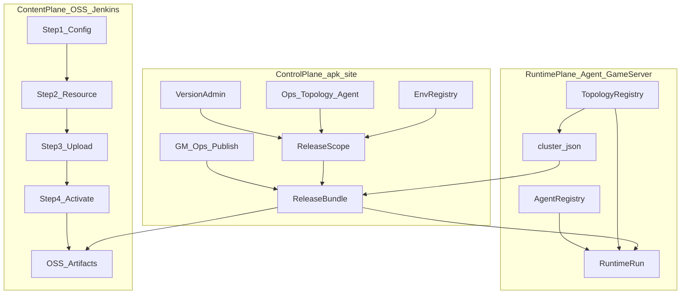
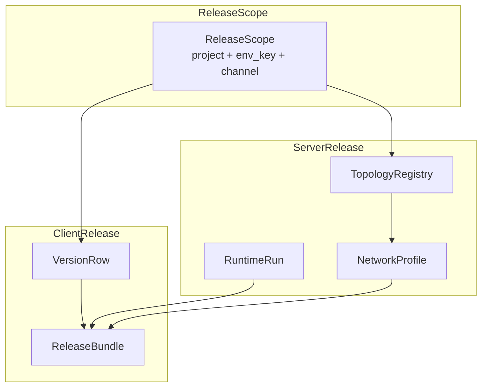
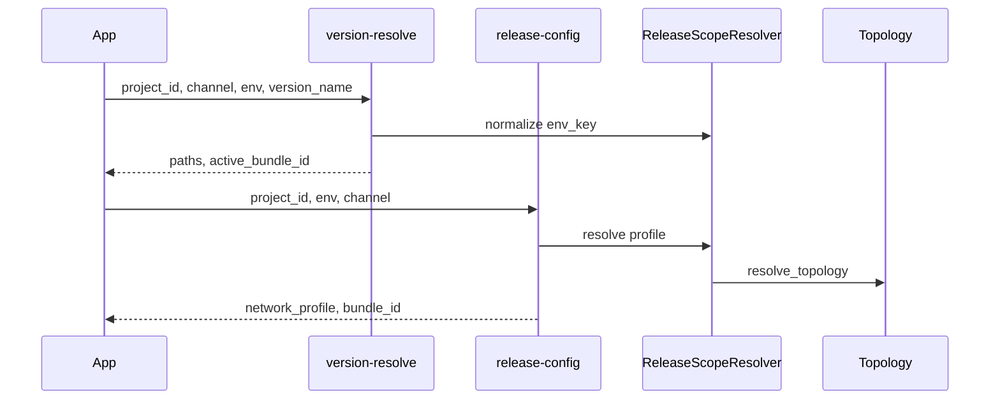
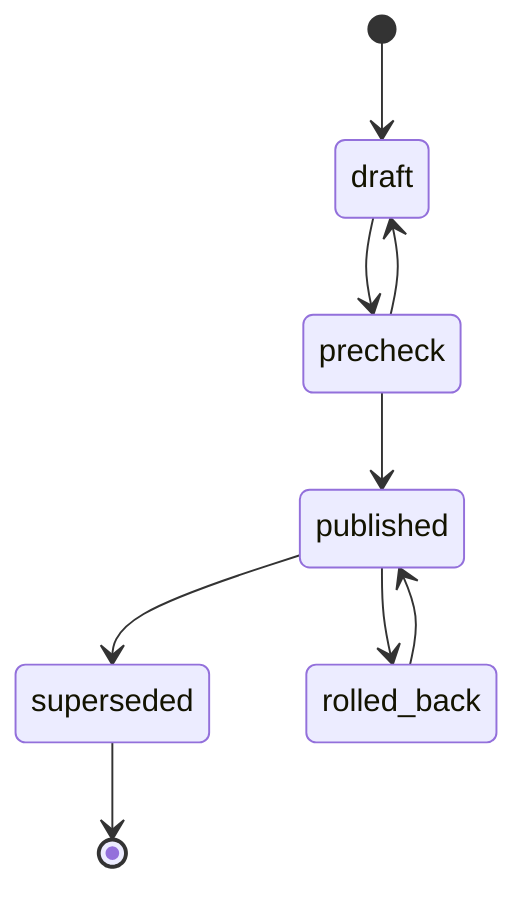
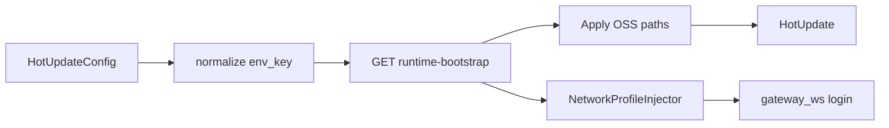
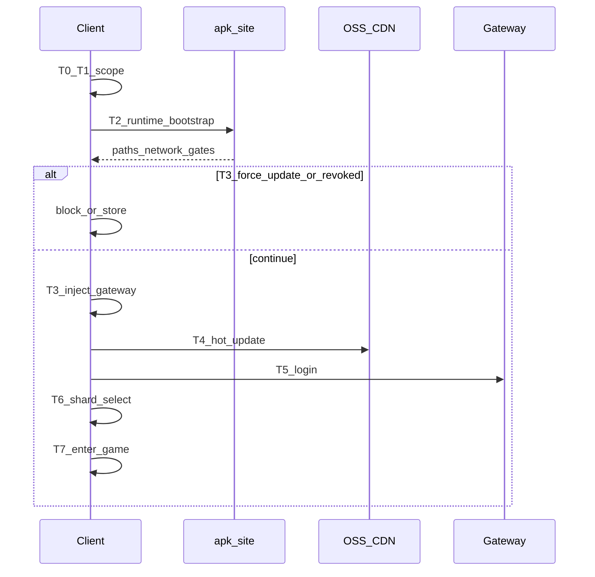
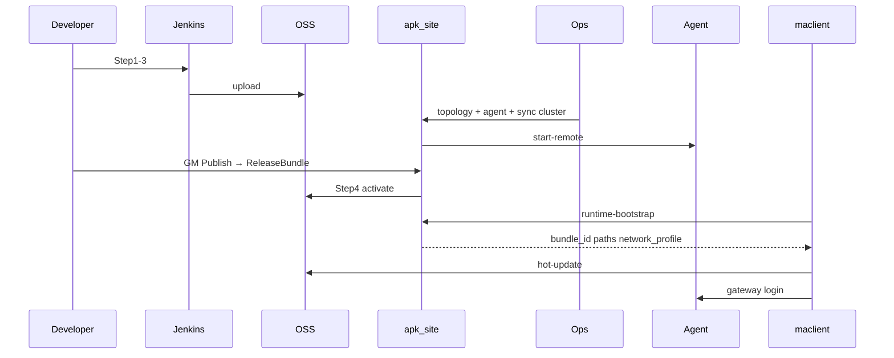

# 客户端-服务端统一发版维护平台 — 整体架构设计

更新时间：2026-06-09  
状态：设计稿（待实现）  
**本文档为唯一权威规范**，涵盖 apk-site Web 管控、maclient 客户端、Jenkins/OSS 构建、Ops 拓扑/Agent 部署与发版闭环。

---

## 目录

1. [背景、愿景与核心决策](#1-背景愿景与核心决策)
2. [三平面架构与术语表](#2-三平面架构与术语表)
3. [ProjectReleaseManifest 与 EnvRegistry](#3-projectreleasemanifest-与-envregistry)
4. [数据模型：ReleaseScope / VersionRow / ReleaseBundle / NetworkProfile](#4-数据模型)
5. [解析流程与发布状态机](#5-解析流程与发布状态机)
6. [混合渠道策略](#6-混合渠道策略)
7. [ContentPlane：Jenkins 四步与 OSS](#7-contentplanejenkins-四步与-oss)
8. [ControlPlane：Web 模块与 API 契约](#8-controlplaneweb-模块与-api-契约)
9. [RuntimePlane：拓扑、Agent、cluster.json](#9-runtimeplane拓扑agentclusterjson)
10. [客户端集成（maclient）](#10-客户端集成maclient)
11. [端到端闭环与对账](#11-端到端闭环与对账)
12. [GomeKu 完整示例](#12-gomeku-完整示例)
13. [门禁、开服向导与关联文档](#13-门禁开服向导与关联文档)
14. [跨项目 Onboarding（7 步）](#14-跨项目-onboarding7-步)
15. [实施路线图 P1–P4](#15-实施路线图-p1p4)
16. [模块集成清单与代码索引](#16-模块集成清单与代码索引)
17. [附录](#17-附录)

---

## 1. 背景、愿景与核心决策

### 1.1 现状问题

客户端版本管理按 **项目 → 渠道 → 环境(stage) → 平台 → VersionName → VersionCode** 组织 APK/热更；运维按 **project_id + env_key + topology_id** 组织服务端。三仓库各自一套词汇与真源：

| 层 | 仓库 | 痛点 |
|----|------|------|
| 客户端热更 | maclient | `HotUpdateConfig.ProjectId` 常为空 → 跳过 Web version-resolve，回退 OSS |
| 客户端联网 | maclient | `ProtocolNetworkSettings` 硬编码 9001/5050，与 `cluster.json` gateway 15050 不一致 |
| Web 管控 | apk-site | 版本库、`GM_RELEASE_PROFILES`、ops 拓扑三套并行 |
| 服务端 | game-server | `cluster.json` 由 ops sync 产出，未与 ReleaseBundle 绑定 |

| 断裂点 | 影响 |
|--------|------|
| 环境词汇三套并行（`stage` / GM `env` / ops `env_key`） | 同一「预发」指代不同存储键 |
| 拓扑 scope 不含 `channel` | 微信/抖音无法结构化绑定渠道级后端差异 |
| `GM_RELEASE_PROFILES` 手工维护 | 与拓扑 canvas 网关地址易漂移 |
| 无 ReleaseBundle | 一次客户端 publish 无法锁定 server runtime 快照 |
| release-config 不读 ops 拓扑 | 客户端启动与运维运行态对账困难 |

### 1.2 愿景

建立 **跨项目可复用** 的统一发版维护架构，三平面贯通：

- **ContentPlane**：Unity/Jenkins 构建、OSS 热更、APK 分发
- **ControlPlane**：Web 版本管理、GM 发布、ReleaseScope / ReleaseBundle
- **RuntimePlane**：Ops 拓扑、Agent 部署、`cluster.json`、game-server 运行时

新项目只需注册 **ProjectReleaseManifest**，按标准 7 步 checklist 接入。

### 1.3 核心决策（已确认）

| 决策 | 说明 |
|------|------|
| **ReleaseScope 为唯一匹配键** | `(project_id, env_key, channel_id)` |
| **ReleaseBundle 为原子发布单元** | 一次 publish 锁定 client 三件套 + server topology/runtime/network 快照 |
| **混合渠道策略** | 默认同 `(project, env)` 共享拓扑；个别渠道可 override topology / profile |
| **Gateway 唯一真源** | 客户端启动以 Web `network_profile` / ReleaseBundle 为唯一真源，运行时覆盖 `ProtocolNetworkSettings`；本地 asset 仅作离线/Editor 兜底 |
| **Unified Bootstrap** | 扩展 `GET /api/public/runtime-bootstrap` 为单次启动入口 |

### 1.4 非目标

- Jenkins 流水线 UI 改造（仅标注对接点）
- 按 env 拆分多份 `cluster.json`（后续单独议题）
- 压测走 `framework_profile=pressure_test` 独立 scope
- 本期不写业务代码（P1–P4 为实施阶段）

---

## 2. 三平面架构与术语表

### 2.1 架构总览



### 2.2 Scope / Bundle 关系图



### 2.3 术语表

| 术语 | 定义 |
|------|------|
| **ProjectReleaseManifest** | 项目 onboarding 模板：project_id、game 凭证、OSS root、渠道、拓扑命名 |
| **EnvRegistry** | canonical `env_key` 与 stage / GM env / Jenkins / OSS 映射 |
| **ReleaseScope** | `(project_id, env_key, channel_id)`；`scope_id = {slug}:{env_key}:{channel_id}` |
| **ReleaseBundle** | 一次 publish 的原子记录；client + server 快照 |
| **NetworkProfile** | 客户端联网地址；topology auto > manual > legacy GM profile |
| **BootstrapContract** | 客户端一次启动所需的全部 Web 下发字段 |
| **ContentPlane** | Jenkins Step1–4、OSS 产物 |
| **ControlPlane** | apk-site 版本 / GM / Scope / Bundle |
| **RuntimePlane** | Ops 拓扑、Agent、cluster.json、RuntimeRun |

---

## 3. ProjectReleaseManifest 与 EnvRegistry

### 3.1 ProjectReleaseManifest

**存储**：`data/project_release_manifests.json`（推荐），或 `data/projects.json` 内嵌 `release_manifest`。

| 字段 | 类型 | 必填 | 说明 |
|------|------|------|------|
| `project_id` | string | 是 | 版本管理系统项目 ID |
| `project_slug` | string | 否 | scope_id 用小写 slug |
| `game_id` / `game_key` | string | 否 | runtime-bootstrap 凭证 |
| `client_repo` | string | 否 | 如 `maclient` |
| `game_server_repo` | string | 否 | 服务端仓库 |
| `cluster_sync_target` | string | 否 | 如 `game-server/config/cluster.json` |
| `oss_project_root` | string | 是 | OSS 根目录名，如 `MyGame1` |
| `oss_base_url` | string | 否 | CDN 根 URL |
| `channels` | array | 是 | 见下表 |
| `default_scopes_per_env` | bool | 否 | 默认 true：4 env × N channel 自动生成 Scope |
| `topology_pattern` | string | 否 | 默认 `topology-{project_slug}-{env_key}-default` |
| `bootstrap_entry` | string | 否 | 默认 `/api/public/runtime-bootstrap` |
| `notice_url` | string | 否 | 写入 NetworkProfile |
| `status` | string | 否 | `active` / `disabled` |

**channels[]**：`channel_id`、`channel_key`（如 wechat）、可选 `platforms`。

**Scope 自动生成**：

```text
for env_key in [development, testing, staging, production]:
  for channel in manifest.channels:
    scope_id = "{project_slug}:{env_key}:{channel.channel_id}"
    create ReleaseScope if not exists
```

### 3.2 EnvRegistry

**Canonical `env_key`**（全仓库唯一）：

| env_key | 说明 |
|---------|------|
| `development` | 开发 |
| `testing` | 测试 |
| `staging` | 预发 |
| `production` | 生产 |

**四表映射**

| canonical `env_key` | 客户端 `stage` | GM `env` | 运维 UI | Jenkins/OSS `Environment` | APK `stage_dir` |
|---------------------|----------------|----------|---------|---------------------------|-------------------|
| `development` | `dev` | `dev` | 开发环境 | `Development` | `dev` |
| `testing` | `test` | `test` | 测试环境 | `Testing` | `test` |
| `staging` | `staging` | `staging` | 预发环境 | `Staging` | `staging`（推荐独立） |
| `production` | `production` | `prod` | 生产环境 | `Production` | `release` |

**别名归一化**（`normalize_release_env_key(raw)`）：

| 输入别名 | 归一结果 |
|----------|----------|
| `dev`, `development`, `Development` | `development` |
| `test`, `testing`, `Testing` | `testing` |
| `staging`, `Staging`, `pre`, `preprod` | `staging` |
| `prod`, `production`, `Production`, `online`, `release` | `production` |

**maclient `HotUpdateConfig.Profile` → env_key**

| Profile | env_key |
|---------|---------|
| Development, Dev | development |
| Testing, Test | testing |
| Staging, Stage | staging |
| Production, Prod | production |

**Staging 策略**：staging 为独立 `env_key`；OSS 用 `Staging/` 前缀；**禁止** silent 映射到 `testing`。

**迁移（双写期）**：Phase 1 双写 `env_key` + legacy；Phase 2 读优先 `env_key`；Phase 3 废弃 legacy。

**Scope ID**：`scope_id = "{project_slug}:{env_key}:{channel_id}"`，例 `gomeku:production:1001`。

---

## 4. 数据模型

### 4.1 ReleaseScope

**存储**：`data/release_scopes.json`

| 字段 | 类型 | 必填 | 说明 |
|------|------|------|------|
| `scope_id` | string | 是 | `{project_slug}:{env_key}:{channel_id}` |
| `project_id` | string | 是 | 项目 ID |
| `env_key` | string | 是 | canonical 四环境 |
| `channel_id` | string | 是 | 如 `1001` |
| `channel_key` | string | 否 | 如 `wechat` |
| `default_topology_id` | string | 否 | 空则 `topology-{project}-{env}-default` |
| `override.topology_id` | string | 否 | 渠道专用拓扑 |
| `override.server_profile_id` | string | 否 | 手工 profile ID |
| `override.use_auto_profile` | bool | 否 | 默认 true |
| `status` | string | 否 | `active` / `disabled` |
| `updated_at` | string | 否 | ISO8601 |

**解析伪代码**

```text
resolve_scope(project_id, env_key, channel_id):
  scope = find_scope(scope_id) or auto_create_default_scope(...)
  return scope

resolve_topology(scope):
  if scope.override.topology_id: return load_topology(override)
  return load_topology(default_topology_id or pattern)

resolve_network_profile(scope):
  if scope.override.server_profile_id: return load_gm_profile(id)
  if scope.override.use_auto_profile != false:
    return build_network_profile_from_topology(resolve_topology(scope))
  return legacy_match_profile(env_key, channel_id)
```

### 4.2 VersionRow 扩展

**存储**：`data/project_versions.json` → `{ project_id: [ rows ] }`

| 字段 | 说明 |
|------|------|
| `scope_id` | 绑定 ReleaseScope |
| `env_key` | canonical |
| `server_binding.topology_id` | 发布快照 |
| `server_binding.runtime_run_id` | 发布快照 |
| `server_binding.profile_source` | `auto` / `manual` / `legacy` |
| `active_bundle_id` | 当前生效 Bundle |

**分组键演进**：`(version_name, channel, stage)` → `(version_name, scope_id)`  
**VersionCode 唯一性**：同 project + version_name + scope_id 下不可重复。

### 4.3 ReleaseBundle

**存储**：`data/release_bundles.json`（Phase 2 可迁 SQLite）

| 字段 | 说明 |
|------|------|
| `bundle_id` | 主键，如 `rb-{date}-{seq}` |
| `project_id`, `scope_id`, `env_key`, `channel_id` | 冗余便于查询 |
| `client` | 客户端快照 |
| `server` | 服务端快照 |
| `publish_status` | 状态机 |
| `published_at`, `published_by` | 发布信息 |
| `supersedes_bundle_id`, `rollback_of_bundle_id` | 链式关系 |

**client 子对象**：`version_id`, `version_name`, `version_code`, `platform`, `apk_path/url`, `resource_version`, `config_version`

**server 子对象**：`topology_id`, `topology_version_label`, `runtime_run_id`, `cluster_sync_at`, `network_profile_snapshot`, `profile_source`, `gateway_probe`

### 4.4 NetworkProfile

与 `GM_RELEASE_PROFILES` 对齐：

| 字段 | 拓扑来源 | 默认规则 |
|------|----------|----------|
| `gateway_ws` | gateway-* | `ws://{probe_host}:{port}/ws/`，port 15050 |
| `login_http` | auth-* | `http://{host}:{port}` |
| `game_ws` | game-* | relay 端口 |
| `battle_udp` | game metadata | 可选 |
| `ops_http` | ops-* | 默认 5504 |
| `notice_url` | ProjectReleaseManifest | 非拓扑 |

**合并**：`merge(build_from_topology(topo), manual_profile)` — manual 非空字段覆盖 auto。

---

## 5. 解析流程与发布状态机

### 5.1 解析总览

```text
resolve_scope(project_id, env_key, channel_id)
  → resolve_topology(scope)
  → resolve_network_profile(scope)
  → find_active_bundle(scope)
  → find_best_version(scope, version_name, platform)
```

### 5.2 客户端启动时序（Legacy 双调用）



**目标**：单次 `runtime-bootstrap` 替代上述双调用；network **只认 release-config / bootstrap**。

### 5.3 发布 / 回滚状态机



| 状态 | 含义 |
|------|------|
| `draft` | 版本行存在，未绑定生效 Bundle |
| `precheck` | 门禁检查中 |
| `published` | 当前 scope 生效 Bundle |
| `superseded` | 被新 Bundle 取代 |
| `rolled_back` | 主动回滚 |

**Rollback**：target Bundle → published；更新 VersionRow `active_bundle_id`；可选 runtime 对齐。

### 5.4 运维发布对齐

1. 运维在 `(project_id, env_key)` 维护拓扑并启动 runtime
2. 版本管理员维护 VersionRow
3. Publish：precheck（三件套、topology 对齐、gateway 探活）
4. CI：`gm_ops_ci_gate.ps1` 校验 bundle 与 topology

---

## 6. 混合渠道策略

| 场景 | Scope 配置 | Bundle 行为 |
|------|------------|-------------|
| 微信/抖音同服 | 无 override，共用 topology | client 不同，server 可相同 runtime_run_id |
| 抖音独立网关 | `override.server_profile_id` 或 `topology_id` | server 快照不同 |
| 仅 APK 不同 | override 空 | 仅 client 段不同 |

---

## 7. ContentPlane：Jenkins 四步与 OSS

### 7.1 参数三层（禁止混用）

| 层 | 生命周期 | 真源 |
|----|----------|------|
| **构建参数** | Unity Step1–2 | Jenkins / Unity CLI |
| **发布参数** | Step3 上传 | Jenkins releaseTargets |
| **运行时参数** | 客户端启动 | Web API 激活后 |

Jenkins 字段 **不得** 写入 version-resolve / runtime-bootstrap 响应。  
详见 maclient `docs/framework/Web-Jenkins-Unity-ParameterSpec.md`。

### 7.2 OSS 目录

```text
{oss_project_root}/{Environment}/{Channel}/{Platform}/version_metadata.json
{oss_project_root}/{Environment}/{Channel}/{Platform}/Version_{version}/{versionCode}/config|code|addressable/...
```

### 7.3 Step4 与 Bundle

- 激活 `version_metadata` 时写入 VersionRow `active_bundle_id`
- CI 校验 Bundle.server 与 ops active runtime 一致

### 7.4 代码入口

| 模块 | 路径 |
|------|------|
| 商业流水线 | `portals/common/core/services/commercial_release_plan.py` |
| maclient 注册 | `maclient/Assets/Editor/ReleaseTools/Core/CommercialReleasePipelineRegistry.cs` |
| Unity CLI | `CommercialReleaseCli`, `ConfigRemotePublishCli`, `ResourcePipelineCli` |

---

## 8. ControlPlane：Web 模块与 API 契约

### 8.1 模块地图

| 模块 | 路径 | 职责 |
|------|------|------|
| 版本 CRUD | `services/admin/version_service.py` | VersionRow + scope_id |
| 版本解析 | `routes/api.py` `/runtime/version-resolve` | OSS 路径 + bundle_id |
| GM 发布 | `routes/gm_ops.py` | bootstrap、release-config、publish |
| Scope/Bundle | `services/release/*`（新建） | resolve、CRUD |
| 拓扑/Agent | `services/ops/helpers.py` | topology → profile；sync cluster |
| 网关推导 | `services/business_test_catalog.py` | `resolve_gateway_endpoint()` |
| 门禁 | `docs/gm_ops_release_gate.md` | quality-gate |

### 8.2 BootstrapContract 字段分组

| 分组 | 字段 | 来源 |
|------|------|------|
| 身份 | project_id, scope_id, env_key, channel_id, active_bundle_id | Scope + Bundle |
| 热更 | version_name, version_code, resource/config/code_relative_path, catalog_file_name | VersionRow |
| 分发 | apk_url, package_name, distribution_method | VersionRow |
| 联网 | network_profile.* | resolve_network_profile |
| 对账 | server_snapshot.topology_id, runtime_run_id, profile_source | Bundle.server |

### 8.3 Unified Bootstrap API（主入口）

**`GET /api/public/runtime-bootstrap`**

| Query | 必填 | 说明 |
|-------|------|------|
| `game_id`, `game_key` | 是 | 解析 project_id |
| `env_key` | 否 | 优先于 env |
| `channel` | 否 | channel_id 或 channel_key |
| `platform` | 否 | 默认 android |
| `version_name` | 否 | APK 版本 |

**响应示例**

```json
{
  "ok": true,
  "project_id": "GomeKu",
  "scope_id": "gomeku:production:1001",
  "env_key": "production",
  "channel_id": "1001",
  "channel_key": "wechat",
  "platform": "android",
  "active_bundle_id": "rb-20260609-wechat-prod-001",
  "profile_source": "auto",
  "bootstrap": {
    "version_name": "1.0.0",
    "version_code": "12",
    "resource_relative_path": "Production/wechat/Android/Version_1.0.0/12",
    "config_relative_path": "Production/wechat/Android/Version_1.0.0/12/config",
    "code_relative_path": "Production/wechat/Android/Version_1.0.0/12/code",
    "catalog_file_name": "catalog_1.0.0.json",
    "apk_url": "https://cdn.example.com/apk/GomeKu_1.0.0_vc12.apk",
    "publish_status": "published"
  },
  "network_profile": {
    "gateway_ws": "ws://127.0.0.1:15050/ws/",
    "login_http": "http://127.0.0.1:15501",
    "game_ws": "ws://127.0.0.1:15502/ws/",
    "ops_http": "http://127.0.0.1:5504",
    "notice_url": "https://notice.example.com/gomeku"
  },
  "server_snapshot": {
    "topology_id": "topology-gomeku-production-default",
    "topology_version_label": "cluster-v1",
    "runtime_run_id": "run-20260609-001"
  }
}
```

### 8.4 其他 API

#### `GET /runtime/version-resolve`

Query 扩展：`env_key`（优先）、`scope_id`（可选）。  
响应 `data` 扩展：`scope_id`, `env_key`, `channel_id`, `active_bundle_id`。

#### `GET /api/public/release-config`

与 bootstrap 同字段子集；供 H5 / 调试。扩展：`scope_id`, `bundle_id`, `profile_source`, `server_snapshot`。

#### 新增 Admin API（Phase 1–2）

| 方法 | 路径 | 说明 |
|------|------|------|
| GET | `/api/release/scopes?project_id=` | 列出 Scope |
| GET | `/api/release/scopes/{scope_id}` | 详情 + profile 预览 |
| POST | `/api/release/scopes/upsert` | 创建/更新 |
| GET | `/api/release/bundles` | 列出 Bundle |
| GET | `/api/release/bundles/{bundle_id}` | Bundle 详情 |
| GET | `/api/release/scopes/{scope_id}/precheck` | 发布前检查 |
| POST | `/api/gm-ops/release/publish` | 创建 Bundle（Phase 2） |
| POST | `/api/gm-ops/release/rollback` | 回滚（Phase 2） |

#### 错误码

| code | HTTP | 说明 |
|------|------|------|
| `RELEASE_SCOPE_NOT_FOUND` | 404 | scope 不存在 |
| `RELEASE_BUNDLE_NOT_FOUND` | 404 | bundle 不存在 |
| `RELEASE_PRECHECK_TOPOLOGY_MISMATCH` | 409 | 拓扑与 runtime 不一致 |
| `RELEASE_PRECHECK_PROBE_FAIL` | 412 | 探活失败 |
| `RELEASE_PRECHECK_CLIENT_INCOMPLETE` | 400 | 三件套不完整 |

---

## 9. RuntimePlane：拓扑、Agent、cluster.json

### 9.1 数据流

```text
Ops Canvas (project_id + env_key)
  → TopologyRegistry (gateway/auth/game/ops/redis/mongo)
  → Agent bind (agent-local-cn-1)
  → sync cluster.json
  → RuntimeRun (start-remote)
  → ReleaseBundle.server snapshot
  → NetworkProfile → BootstrapContract
```

### 9.2 Per-env 隔离

- `topology-gomeku-production-default`
- `topology-gomeku-staging-default`
- 最小栈 6 节点：gateway、auth、game、ops、redis-cache、mongo-db

### 9.3 cluster.json ↔ NetworkProfile

| network_profile | cluster/topology 来源 | 规则 |
|-----------------|----------------------|------|
| gateway_ws | gateway-* ProbeHost+Port+Path | ws://host:15050/ws/ |
| login_http | auth-* | http://host:port |
| game_ws | game-* relay | ClusterRelayPort |
| ops_http | ops-* | 默认 5504 |

**禁止**：maclient 本地 Gateway 与 Bundle 不一致时 silent 使用本地值（Player fail-fast；Editor 可 `AllowLocalNetworkOverride`）。

### 9.4 Agent 与 Bundle

| 阶段 | 行为 |
|------|------|
| 注册/占位 | server_provision_wizard → agent placeholder |
| 绑定 | Ops bind-agent |
| 启动 | start-remote / agent job |
| precheck | topology_id == active RuntimeRun |
| 回滚 | Bundle 链 + 可选 re-sync cluster |

---

## 10. 客户端集成（maclient）

### 10.1 核心原则

| 原则 | 说明 |
|------|------|
| Gateway 唯一真源 | Web `network_profile` 覆盖 `ProtocolNetworkSettings` |
| Unified Bootstrap | 单次 runtime-bootstrap |
| ReleaseScope | HotUpdateConfig 填齐 ProjectId / Channel / Profile |
| 参数分层 | Jenkins ≠ Bootstrap 响应 |

### 10.2 现状

| 组件 | 路径 | 问题 |
|------|------|------|
| 启动链 | `Assets/Src/Main.cs` | 仅 version-resolve，未注入 network |
| 版本解析 | `RuntimeVersionResolveService.cs` | `/api/runtime/version-resolve` |
| 热更配置 | `HotUpdateConfig.asset` | ProjectId 常空 |
| 联网 | `ProtocolNetworkSettings.asset` | 9001/5050 vs cluster 15050 |

### 10.3 HotUpdateConfig 必填项

| 字段 | 平台概念 | 说明 |
|------|----------|------|
| `ProjectId` | manifest.project_id | 空则无法 bootstrap |
| `Channel` | scope.channel_key | 如 wechat |
| `Profile` | → env_key | 见 §3.2 映射表 |
| `ResourceServerUrl` | OSS CDN 根 | 拼接相对路径 |
| `AllowOssMetadataFallback` | — | 生产 false；dev 可 true |

### 10.4 目标启动流程

```text
1. HotUpdateConfig → normalize env_key
2. GET /api/public/runtime-bootstrap?game_id&game_key&env_key&channel&platform&version_name
3. Apply bootstrap.* → BootstrapContext
4. NetworkProfileInjector.Apply(network_profile)
5. 下载 Catalog / Code / Config
6. LoginState 使用 gateway_ws
```



### 10.5 NetworkProfileInjector（Phase 3）

**计划路径**：`Assets/Src/Foundation/Bootstrap/NetworkProfileInjector.cs`

```csharp
public static ApplyResult Apply(NetworkProfileDto profile, NetworkApplyOptions options)
{
    if (string.IsNullOrEmpty(profile?.GatewayWs))
        return ApplyResult.Fail("network_profile.gateway_ws required");
    var settings = ProtocolNetworkSettings.Instance;
    if (!options.AllowLocalOverride && settings.GetGatewayWs(options.EnvKey) != profile.GatewayWs
        && options.FailOnDrift)
        return ApplyResult.Fail("local gateway drift");
    settings.SetRuntimeOverlay(options.EnvKey, profile);
    return ApplyResult.Ok();
}
```

**Apply 顺序**：bootstrap → 校验 active_bundle_id → Apply paths → Inject network → 热更 → 登录

### 10.6 Editor 验收清单

- [ ] `HotUpdateConfig.ProjectId` 非空且与 apk-site 一致
- [ ] Channel / Profile 与 ReleaseScope 一致
- [ ] CommercialBundleReleaseWindow Scope 预览 gateway = ops 拓扑
- [ ] PlayMode：bootstrap 返回 bundle_id + gateway 15050 登录成功

### 10.7 maclient 代码索引

| 项 | 路径 |
|----|------|
| 启动链 | `Assets/Src/Main.cs` |
| 版本解析 | `Assets/Src/Foundation/Bootstrap/RuntimeVersionResolveService.cs` |
| 版本 API 文档 | `Assets/Src/Foundation/Bootstrap/RuntimeVersionResolveApi.md` |
| 热更配置 | `Assets/Content/Resources/HotUpdateConfig.asset` |
| 联网配置 | `Assets/Resources/Protocol/ProtocolNetworkSettings.asset` |
| Editor | `Assets/Editor/ReleaseTools/Editor/CommercialBundleReleaseWindow.cs` |
| 商业流水线 | `docs/framework/CommercialReleasePipelineApi.md` |
| PlayMode 测试 | `Assets/Src/HotUpdate/Tests/PlayMode/ClientStartupHotUpdatePlayModeTests.cs` |

### 10.8 非 Unity 客户端

实现 BootstrapContract 即可：HTTP bootstrap → 热更路径 → `network_profile.gateway_ws` → 缓存 `active_bundle_id`。

### 10.9 商业手游标准冷启动时序（T0–T7）

国内成熟商业手游（渠道包 + OSS 热更 + 网关登录）的 **玩家侧单次冷启动** 规范顺序如下。运营侧发版顺序见 §11。

#### 玩家侧时序

| 阶段 | 行为 | 本仓库入口 | 验收要点 |
|------|------|------------|----------|
| **T0** | App 启动，读 APK `version_name`、渠道参数 | `HotUpdateConfig.asset` | 包体版本非空 |
| **T1** | 解析 **ReleaseScope** `(project, env_key, channel_id)` | manifest + `normalize_release_env_key` | 与 GM 发版 scope 一致 |
| **T2** | 一次 HTTP 拉配置 | `GET /api/public/runtime-bootstrap` | paths + network + bundle + 门禁字段 |
| **T3** | 门禁（强更/吊销/灰度）+ `NetworkProfileInjector` | bootstrap 响应 + `NetworkProfileInjector.cs` | gateway 注入成功 |
| **T4** | OSS 热更 catalog → config → code | `StartupUpdateOrchestrator.cs` | 三阶段完成 |
| **T5** | Gateway WebSocket 登录 | `LoginState` + `gateway_ws` | 连上 `:15050`（Development 示例） |
| **T6** | **GameShard 选服**（登录后） | `ResolveServerSelectionStage` | **不决定**热更 catalog 版本 |
| **T7** | 进游戏逻辑服 | GameState | 主循环 |



#### 术语表（避免混用）

| 术语 | 含义 | 决定热更版本？ |
|------|------|----------------|
| **ReleaseScope** | 环境 + 渠道，如 `gomeku:development:1001` | **是** |
| **GameShard** | 登录后选服（一区、新服） | **否** |
| **ReleaseBundle** | 一次 GM Publish 锁定的 client+server 快照 | 绑定 active 版本 |
| **network_profile** | gateway/login/game 地址（来自 Ops 拓扑） | 否（只决定连哪） |

#### 运营侧发版时序（单次）

```text
Jenkins Step1–3 → OSS 上传
→ Ops 拓扑保存/sync
→ GM precheck → POST /api/gm-ops/release/publish → ReleaseBundle + active_bundle_id
→ 客户端下次 T2 bootstrap 自动对齐
```

#### 阶段验收命令

```bash
python portals/common/core/scripts/release_platform_ci_gate.py --scope-id gomeku:development:1001
python portals/common/core/scripts/verify_e2e_release.py
python portals/common/core/scripts/commercial_startup_sequence_gate.py
```

---

## 11. 端到端闭环与对账



| 对账项 | 客户端 | Web/Ops |
|--------|--------|---------|
| active_bundle_id | Bootstrap | ReleaseBundle published |
| gateway_ws | Injector 使用后 | topology / Bundle snapshot |
| OSS 路径 | BootstrapContext | VersionRow |
| topology_id | server_snapshot | active RuntimeRun |

---

## 12. GomeKu 完整示例

### 12.1 ProjectReleaseManifest

```json
{
  "project_id": "GomeKu",
  "project_slug": "gomeku",
  "game_id": "gomeku-game-id",
  "game_key": "gomeku-game-key",
  "client_repo": "maclient",
  "game_server_repo": "game-server",
  "cluster_sync_target": "game-server/config/cluster.json",
  "oss_project_root": "MyGame1",
  "channels": [
    { "channel_id": "1001", "channel_key": "wechat" },
    { "channel_id": "1002", "channel_key": "douyin" }
  ],
  "default_scopes_per_env": true,
  "topology_pattern": "topology-{project_slug}-{env_key}-default",
  "status": "active"
}
```

### 12.2 Scope 矩阵

| scope_id | env | channel | 拓扑 | profile |
|----------|-----|---------|------|---------|
| gomeku:production:1001 | production | wechat | topology-gomeku-production-default | auto |
| gomeku:production:1002 | production | douyin | 同上 | manual: douyin-prod-gateway |
| gomeku:staging:1001 | staging | wechat | topology-gomeku-staging-default | auto |

### 12.3 ReleaseScope — 微信

```json
{
  "scope_id": "gomeku:production:1001",
  "project_id": "GomeKu",
  "env_key": "production",
  "channel_id": "1001",
  "channel_key": "wechat",
  "default_topology_id": "topology-gomeku-production-default",
  "override": { "use_auto_profile": true },
  "status": "active"
}
```

### 12.4 ReleaseScope — 抖音 override

```json
{
  "scope_id": "gomeku:production:1002",
  "project_id": "GomeKu",
  "env_key": "production",
  "channel_id": "1002",
  "channel_key": "douyin",
  "override": {
    "server_profile_id": "douyin-prod-gateway",
    "use_auto_profile": false
  },
  "status": "active"
}
```

### 12.5 ReleaseBundle — 微信 production

```json
{
  "bundle_id": "rb-20260609-wechat-prod-001",
  "project_id": "GomeKu",
  "scope_id": "gomeku:production:1001",
  "client": {
    "version_name": "1.0.0",
    "version_code": "12",
    "platform": "android",
    "resource_version": "1.0.0.12",
    "config_version": "1.0.0.12"
  },
  "server": {
    "topology_id": "topology-gomeku-production-default",
    "runtime_run_id": "run-20260609-001",
    "network_profile_snapshot": {
      "gateway_ws": "ws://127.0.0.1:15050/ws/",
      "login_http": "http://127.0.0.1:15501",
      "game_ws": "ws://127.0.0.1:15502/ws/",
      "ops_http": "http://127.0.0.1:5504"
    },
    "profile_source": "auto",
    "gateway_probe": { "ok": true, "rtt_ms": 12 }
  },
  "publish_status": "published",
  "supersedes_bundle_id": "rb-20260608-wechat-prod-004"
}
```

---

## 13. 门禁、开服向导与关联文档

### 13.1 quality-gate 扩展

| 检查项 | 说明 |
|--------|------|
| scope_resolved | scope active |
| topology_runtime_aligned | topology == active runtime |
| profile_probe_pass | gateway/ops 探活 PASS |
| bundle_client_complete | 三件套齐全 |
| bundle_server_snapshot | server 段完整 |

CI：`gm_ops_ci_gate.ps1` 增加 `-ScopeId` 或 `-EnvKey` + `-ChannelId`。

### 13.2 与开服向导

Provision 改变 topology → **不自动** publish Bundle。运维验证后 GM **重新 publish**。  
详见 `server_provision_wizard_design.md`。

### 13.3 关联文档（专项，不在本文重复）

| 文档 | 内容 |
|------|------|
| `server_provision_wizard_design.md` | 开服向导、cluster sync |
| `拓扑编排详细设计方案.md` | Ops Canvas、Agent 绑定 |
| `gm_ops_release_gate.md` | 发布门禁细则 |
| maclient `Web-Jenkins-Unity-ParameterSpec.md` | Jenkins 参数分层 |

---

## 14. 跨项目 Onboarding（7 步）

| 步 | 动作 | 产出 |
|----|------|------|
| 1 | 注册 ProjectReleaseManifest | project_id、game 凭证、channels |
| 2 | 自动生成 ReleaseScope | release_scopes.json |
| 3 | Ops 创建 per-env topology + Agent | cluster.json |
| 4 | maclient HotUpdateConfig | ProjectId、Channel、Profile |
| 5 | Jenkins 绑定 commercial plan | project_id、Environment |
| 6 | GM Publish + Step4 激活 | active_bundle_id |
| 7 | 客户端 bootstrap 验收 | 热更 + gateway + bundle 对账 |

**P4 验收**：第二项目仅改 manifest + 客户端配置，不改平台代码。

---

## 15. 实施路线图 P1–P4

### P1 — 词汇与真源（4–6 人日）

- `normalize_release_env_key()`、`build_network_profile_from_topology()`
- release-config / bootstrap 读 Scope + auto profile
- version-resolve 返回 scope_id、active_bundle_id
- VersionRow 双写 scope_id / env_key
- **验收**：GomeKu production/wechat gateway_ws = ops 探活

### P2 — ReleaseBundle 闭环（6–8 人日）

- Bundle CRUD、GM publish/rollback、precheck API
- Step4 绑定 active_bundle_id、CI gate
- **验收**：publish/rollback 可审计

### P3 — maclient 对齐（4–6 人日）

- RuntimeBootstrapService、NetworkProfileInjector
- ProjectId 强制、Player fail-on-drift
- **验收**：gateway 15050 登录 + bundle_id 对账

### P4 — 多项目模板（4 人日）

- Manifest UI/CLI、7 步向导、第二项目 E2E

---

## 16. 模块集成清单与代码索引

### 16.1 新建/改动文件

| 文件 | Phase | 改动 |
|------|-------|------|
| `services/release/env_registry.py` | P1 | 新建 |
| `services/release/scope_resolver.py` | P1 | 新建 |
| `services/release/profile_builder.py` | P1 | 新建 |
| `services/release/bundle_service.py` | P2 | 新建 |
| `data/project_release_manifests.json` | P1 | 新建 |
| `data/release_scopes.json` | P1 | 新建 |
| `data/release_bundles.json` | P2 | 新建 |
| `routes/gm_ops.py` | P1–2 | bootstrap 扩展 |
| `routes/api.py` | P1–2 | version-resolve |
| maclient NetworkProfileInjector | P3 | 新建 |
| maclient RuntimeBootstrapService | P3 | 新建 |

### 16.2 现有代码入口

| 模块 | 路径 |
|------|------|
| 版本 CRUD | `portals/common/core/services/admin/version_service.py` |
| 版本解析 | `portals/common/core/routes/api.py` |
| GM 发布 | `portals/common/core/routes/gm_ops.py` |
| 运维拓扑 | `portals/common/core/services/ops/helpers.py` |
| 热更路径 | `portals/common/core/services/commercial_release_plan.py` |
| maclient 启动 | `E:/maclient/Assets/Src/Main.cs` |
| game-server cluster | `E:/maclient/game-server/config/cluster.json` |

---

## 17. 附录

### 17.1 问题 → 修复映射

| 问题 | Phase | 修复 |
|------|-------|------|
| ProjectId 空 | P3 | Manifest → HotUpdateConfig |
| Gateway 端口不一致 | P1+P3 | auto profile + Injector |
| staging 四环境 | P1 | EnvRegistry |
| cluster 未绑 Bundle | P2 | ReleaseBundle.server |
| 双 API 启动 | P3 | Unified bootstrap |

### 17.2 设计验收清单

- [x] 三平面架构
- [x] EnvRegistry 四表 + staging
- [x] ReleaseScope / Bundle / VersionRow Schema
- [x] Unified Bootstrap API
- [x] maclient NetworkProfileInjector
- [x] RuntimePlane cluster ↔ profile
- [x] GomeKu 示例 JSON
- [x] 7 步 onboarding + P1–P4 路线图

### 17.3 修订记录

| 日期 | 说明 |
|------|------|
| 2026-06-09 | 合并 universal_release_platform、client_server_release_unification、maclient 客户端集成为唯一规范 |
